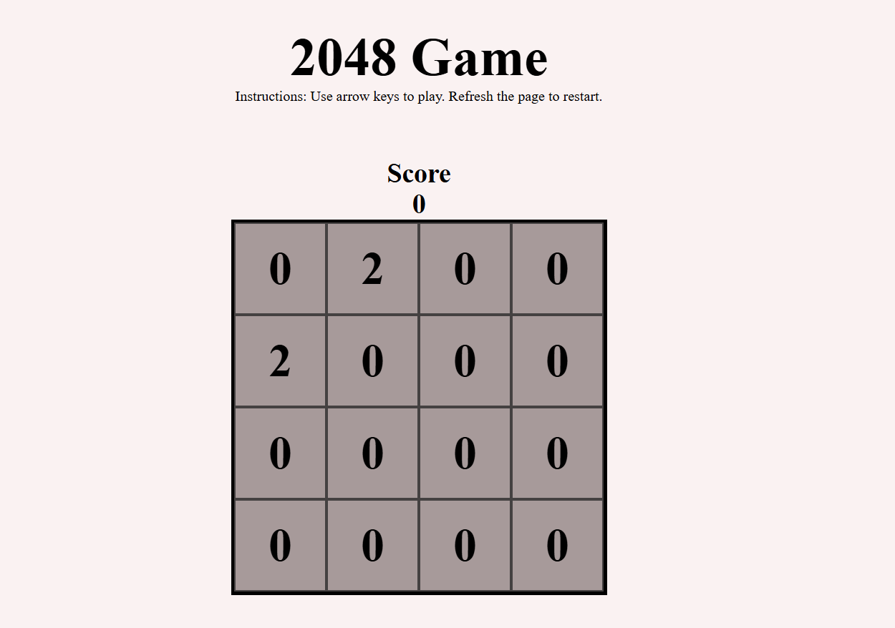

2048 Game

🎮 About the Game

The 2048 Game is a fun and addictive sliding puzzle game where you combine numbered tiles to reach the 2048 tile. The game is played on a 4×4 grid, and players slide tiles in four possible directions: up, down, left, and right. When two tiles with the same number collide, they merge into one with double the value. The goal is to create a tile with the number 2048.

🚀 Features

Smooth sliding animations

Simple and intuitive UI

Undo move functionality

Score tracking

Responsive design for desktop and mobile

Local storage to save progress

🛠️ Technologies Used

HTML – For the game structure

CSS – For styling and layout

JavaScript – For game logic and interactivity

🎯 How to Play

Start the game – The board starts with two random tiles.

Use arrow keys (or swipe on mobile) to move tiles.

Merge tiles – When two tiles with the same number touch, they combine.

Reach 2048 – Keep merging tiles to reach the 2048 tile and win!

Game Over – If no moves are left, the game ends.

## 📷 Screenshots
   

🔥 Future Enhancements

Add different board sizes (e.g., 5×5, 6×6)

Implement multiplayer mode

Add leaderboard and online scoring
